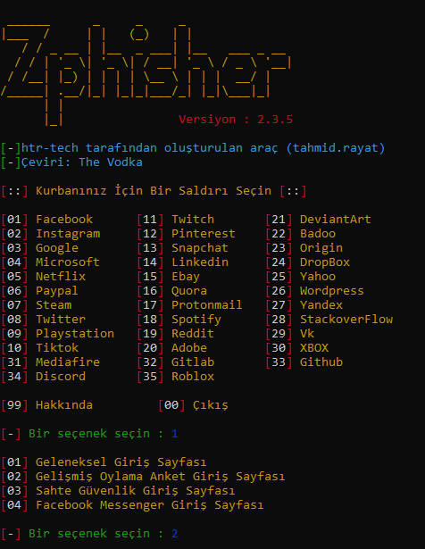

<!-- Zphisher -->

<p align="center">
  
</p>

<p align="center">
  
  
  
  
  
</p>

<p align="center">
  
  
  
  
  </a>
</p>

<p align="center"><b>Yeni başlayanlar için uygun, 30'dan fazla şablon içeren otomatik kimlik avı aracı.</b></p>

##
<h3><p align="center">Sorumluluk Reddi</p></h3>

<i>Bu proje <a href="https://github.com/htr-tech/zphisher">htr-tech</a> tarafından oluşturulmuş, The Vodka tarafından Türkçeleştirilerek Türkçe optimizasyonu sağlanmıştır.</b>

<h3><p align="center">Sorumluluk Reddi</p></h3>

<i><b>Zphisher</b> ile ilgili herhangi bir eylem ve/veya faaliyet yalnızca sizin sorumluluğunuzdadır. Bu araç setinin kötüye kullanılması, söz konusu kişilere karşı <b>suçlu suçlamalara</b> neden olabilir. Bu araç setini yasayı çiğnemek için kötüye kullanan herhangi bir kişiye karşı herhangi bir suç duyurusunda bulunulması durumunda <b>katkıda bulunanlar sorumlu tutulmayacaktır</b>.

<b>Bu araç seti, sosyal medya için potansiyel olarak zararlı veya tehlikeli olabilecek materyaller içermektedir</b>. Buna erişmeden, kullanmadan veya başka bir şekilde yanlış bir şekilde kullanmadan önce ilinizdeki/ülkenizdeki yasalara bakın.

<b>Bu Araç yalnızca eğitim amaçlı yapılmıştır</b>. Burada yer alan herhangi bir şeyle yasayı ihlal etmeye çalışmayın. <b>Eğer niyetin buysa, defol git buradan</b>!

Yalnızca "kimlik avının nasıl çalıştığını" gösterir. <b>Birinin sosyal medyasına yetkisiz erişim elde etmek için bilgileri kötüye kullanmamalısınız</b>. Ancak bunu riski size ait olmak üzere deneyebilirsiniz.</i>

##

### Özellikler

- En son ve güncel giriş sayfaları.
- Yeni başlayanlar dostu
- Çoklu tünelleme seçenekleri
  - Yerel ana bilgisayar
  - Bulut alevlendi
  - YerelXpose
- Maske URL desteği
- Liman işçisi desteği

##

### Kurulum

- Sadece, bu depoyu klonla -
  ```
  git clone --depth=1 https://github.com/vo-ai/tr.zphisher/
  ```

- Şimdi klonlanmış dizine gidin ve `zphisher.sh` dosyasını çalıştırın -
  ```
  $ cd tr.zphisher
  $ bash zphisher.sh
  ```

- İlk başlatmada, bağımlılıkları kuracak ve hepsi bu. ***Zphisher*** kuruludur.

##


### Not:
***Termux, bilgisayar korsanlığını teşvik etmez*** .. Bu nedenle, termux tartışma gruplarının hiçbirinde *zphisher* ile ilgili hiçbir şeyi asla tartışmayın. Daha fazla kontrol için: [wiki]
(https://wiki.termux.com/wiki/Hacking)

##

<p align="left">
  <a href="https://shell.cloud.google.com/cloudshell/open?cloudshell_git_repo=https://github.com/htr-tech/zphisher.git&tutorial=README.md" target="_blank"></a>
</p>

##

### ".deb" dosyası üzerinden kurulum

- [**Son Sürüm**](https://github.com/htr-tech/zphisher/releases/latest) adresinden `.deb` dosyalarını indirin
- ***termux*** kullanıyorsanız `*_termux.deb` dosyasını indirin

- Çalıştırarak `.deb` dosyasını kurun
  ```
  apt install <your path to deb file>
  ```
  Veya
  ```
  $ dpkg -i <your path to deb file>
  $ apt install -f
  ```

##

### Docker'da çalıştırın

- Docker Görüntü Aynası:
  - **DockerHub** : 
    ```
    docker pull htrtech/zphisher
    ```
  - **GHCR** : 
    ```
    docker pull ghcr.io/htr-tech/zphisher:latest
    ```

- [**run-docker.sh**] sarmalayıcı komut dosyasını kullanarak(https://raw.githubusercontent.com/htr-tech/zphisher/master/run-docker.sh)

  ```
  $ curl -LO https://raw.githubusercontent.com/htr-tech/zphisher/master/run-docker.sh
  $ bash run-docker.sh
  ```
- Geçici Konteyner

  ```
  docker run --rm -ti htrtech/zphisher
  ```
  - `auth` dizinini bağlamayı unutmayın.

##

<details>
  <summary><h3>Gereksinimler</h3></summary>

<b>Zphisher</b> düzgün çalışması için aşağıdaki programları gerektirir -
- `git`
- `curl`
- `php`

> **Zphisher**'ı ilk kez çalıştırdığınızda tüm bağımlılıklar otomatik olarak kurulacaktır.
</details>

<details>
  <summary><h3>üzerinde test edildi</h3></summary>

- **Ubuntu**
- **Debian**
- **Arch**
- **Manjaro**
- **Fedora**
- **Termux**
</details>

##

<h3 align="center"><i>:: iş akışı ::</i></h3>
<p align="center">

</p>

##

### Beni bul:
<p align="left">
  <a href="https://tahmidrayat.is-a.dev" target="_blank"></a>
  <a href="https://github.com/htr-tech" target="_blank"></a>
</p>


### *Proje Katılımcıları*:

<table>
  <tr align="center">
    <td><a href="https://github.com/1RaY-1"><br /><sub><b>1RaY-1</b></sub></a></td>
    <td><a href="https://github.com/adi1090x"><br /><sub><b>Aditya Shakya</b></sub></a></td>
    <td><a href="https://github.com/AliMilani"><br /><sub><b>Ali Milani</b></sub></a></td>
    <td><a href="https://github.com/Meht-evaS"><br /><sub><b>AmnesiA</b></sub></a></td>
    <td><a href="https://github.com/KasRoudra"><br /><sub><b>KasRoudra</b></sub></a></td>
   <td><a href="https://github.com/MoisesTapia"><br /><sub><b>Moises Tapia</b></sub></a></td>
  </tr>
  <tr align="center">
   <td><a href="https://github.com/E343IO"><br /><sub><b>Mr.Derek</b></sub></a></td>
    <td><a href="https://github.com/BDhackers009"><br /><sub><b>Mustakim Ahmed</b></sub></a></td>
    <td><a href="https://github.com/sepp0"><br /><sub><b>sepp0</b></sub></a></td>
    <td><a href="https://github.com/TripleHat"><br /><sub><b>TripleHat</b></sub></a></td>
    <td><a href="https://github.com/Yisus7u7"><br /><sub><b>Yisus7u7</b></sub></a></td>
  </tr>
<table>

<!-- // -->
